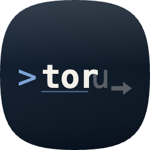

<div align="center">
  

  # Toru CLI

  A native macOS terminal emulator built in Swift. Lightweight, comment-aware, with fish-style autocomplete — 100% local, no AI, no cloud, no account.

  [](LICENSE)
  [](#requirements)
  [](#requirements)
  [](https://github.com/dimsmaul/toru-cli/actions/workflows/release.yml)
</div>

## Features

- **Native macOS UI** — SwiftUI + AppKit. NavigationSplitView, native tabs, system accent color, automatic dark/light.
- **Block-based output** — every command and its output live in their own collapsible card, Warp-style.
- **Comment skipping** — lines beginning with `#` are visible but not executed. Multi-line blocks are filtered before they reach the shell.
- **Fish-style inline autocomplete** — ghost text driven by your local SQLite history. Press `→` or `Tab` to accept.
- **History fuzzy search** — `Cmd+F` filters and highlights matches across the visible blocks.
- **Tab rename per running command** — `bun start` becomes the tab title until it exits, then reverts.
- **Tab completion** — `$PATH` commands and files in the working directory.
- **Themes** — five built-ins (Dark, Light, Solarized Dark, Tokyo Night, One Dark). Drop a JSON file into Settings → Appearance to import a custom theme.
- **No telemetry, no network calls.** Everything runs locally.

## Install

### Homebrew (recommended)

The fastest path. Homebrew strips the macOS quarantine attribute on cask installs, so Toru launches without the *"Apple could not verify…"* dialog.

```bash
brew tap dimsmaul/toru-cli
brew install --cask toru-cli
```

Update later with:

```bash
brew upgrade --cask toru-cli
```

### Direct DMG

Grab the latest DMG from the [Releases page](https://github.com/dimsmaul/toru-cli/releases) and drag `Toru CLI.app` to `/Applications`.

The DMG is **ad-hoc signed but not Apple-notarized** (no paid Developer ID), so the first launch is gated by Gatekeeper. Bypass it once via either:

- **Right-click** the app in `/Applications` → **Open** → **Open** in the confirmation dialog. macOS remembers the choice.
- Or strip the quarantine flag in Terminal:

  ```bash
  xattr -dr com.apple.quarantine "/Applications/Toru CLI.app"
  ```

Subsequent launches are normal.

## Requirements

- macOS 15.5 (Sequoia) or newer
- Xcode 16+ to build from source
- Swift 5.10+

## Build from source

```bash
git clone https://github.com/dimsmaul/toru-cli.git
cd "toru-cli/Toru CLI"
open "Toru CLI.xcodeproj"
```

Press `⌘R` in Xcode. Or build a distributable DMG locally:

```bash
./scripts/build-dmg.sh             # version derived from `git describe`
./scripts/build-dmg.sh v1.2.3      # explicit version label
```

Output lands in `dist/Toru-CLI-<version>.dmg`.

## Releasing (maintainers)

The release pipeline lives in [.github/workflows/release.yml](.github/workflows/release.yml). It auto-bumps the latest semver tag, builds, signs ad-hoc, packages a DMG, attaches it to a GitHub Release, and pushes a Cask update to [`dimsmaul/homebrew-toru-cli`](https://github.com/dimsmaul/homebrew-toru-cli).

Three ways to trigger a release:

- **Commit-driven** (preferred). Push a commit to `main` whose message contains `release: patch`, `release: minor`, or `release: major`. The workflow bumps the latest `v*` tag accordingly and builds.

  ```
  fix: terminal flicker on resize

  release: patch
  ```

- **Manual dispatch.** Actions tab → *Release* → *Run workflow*, set `bump` to `patch` / `minor` / `major`. Same outcome as commit-driven.

- **Direct tag push.** `git tag v0.2.0 && git push origin v0.2.0`. Skips the bump step but still builds and publishes.

A run with `bump = none` and an optional `version` label produces a downloadable artifact only — no Release row, no Cask bump. Useful for one-off test builds.

## Keybindings

| Shortcut       | Action                       |
|----------------|------------------------------|
| `→` / `Tab`    | Accept ghost-text suggestion |
| `Escape`       | Dismiss ghost text / popup   |
| `Cmd+F`        | Search blocks (highlight matches) |
| `Tab`          | Tab completion (when no ghost) |
| `⌘T`           | New tab                      |
| `⌘W`           | Close tab                    |
| `⌘D`           | Split pane horizontal        |
| `⌘⇧D`          | Split pane vertical          |
| `⌘,`           | Settings                     |
| `⌘+` / `⌘-`    | Increase / decrease font size |
| `⌘K`           | Clear blocks                 |
| `⌘⇧C` / `⌘⇧V`  | Copy / paste                 |

## Comment syntax

Lines whose first non-whitespace character is `#` are stripped before being sent to the shell.

```
# build for production
bun run build
# upload to cloud
gcloud run deploy
```

Only `bun run build` and `gcloud run deploy` are executed. The comment lines remain visible in the terminal scrollback as italic gray annotations. Inline trailing comments (`bun build # fast`) are not stripped.

## Architecture

```
SwiftUI Layer
  WindowGroup → NavigationSplitView → Sessions / Tabs
        │
AppKit Bridge (NSViewRepresentable)
        │
TorTerminalView : LocalProcessTerminalView (SwiftTerm)
        │
Input Pipeline
  CommentFilter → AutocompleteEngine → PTY
        │
Output Pipeline
  PTY tap → AnsiAttributedRenderer + GridEmulator → BlockStore
        │
Persistence
  HistoryDatabase (GRDB / SQLite)
  ThemeManager
  SettingsStore (UserDefaults)
```

Full design spec: [`docs/superpowers/specs/2026-05-08-toru-cli-design.md`](docs/superpowers/specs/2026-05-08-toru-cli-design.md). Original PRD: [`PRD-MacTerminal.md`](PRD-MacTerminal.md).

## Themes

Built-in: **Dark**, **Light**, **Solarized Dark**, **Tokyo Night**, **One Dark**. Each theme is a JSON file at `Toru CLI/Themes/builtin/`:

```json
{
  "name": "Tokyo Night",
  "background": "#1a1b26",
  "foreground": "#a9b1d6",
  "cursor": "#c0caf5",
  "ansi": ["#15161e", "...", "#c0caf5"]
}
```

Custom themes: drop a JSON file into Settings → Appearance to import.

## Contributing

Pull requests are welcome. See [CONTRIBUTING.md](CONTRIBUTING.md) for the workflow and [CODE_OF_CONDUCT.md](CODE_OF_CONDUCT.md).

## License

[MIT](LICENSE) © 2026 Dimas Maulana

## Acknowledgments

- [SwiftTerm](https://github.com/migueldeicaza/SwiftTerm) by Miguel de Icaza — VT100 / xterm emulation.
- [GRDB.swift](https://github.com/groue/GRDB.swift) by Gwendal Roué — SQLite ORM.
